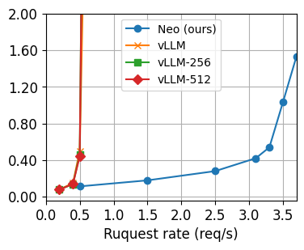
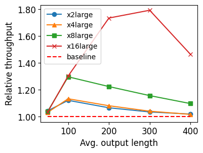

# NEO: Saving GPU Memory Crisis with CPU Offloading for Online LLM Inference

Online LLM inference powers many exciting applications such as intelligent chatbots and autonomous agents. Modern LLM inference engines widely rely on request batching to improve inference throughput, aiming to make it cost-efficient when running on expensive GPU accelerators. However, the limited GPU memory has largely limited the batch size achieved in practice, leaving significant GPU compute resources wasted. 

NEO is an online LLM inference system that offloads part of attention compute and KV cache states from the GPU to the local host CPU, effectively increasing the GPU batch size and thus inference throughput. To this end, NEO proposes asymmetric GPU-CPU pipelining and load-aware scheduling to balance GPU and CPU loads and fully utilize their compute and memory resources.

## Requirements

Python >= 3.10
PyTorch >= 2.4

2 versions of g++ (see `pacpu/build.sh` for more details):

- one >= 13 (for compiling CPU kernel)
- the other < 13 (for passing the NVCC version check)

Intel ISPC compiler == 1.23, which can be installed by `sudo snap install ispc --channel latest/edge`

## Installation

1. Clone the NEO repository and `cd` into the repo.

2. Install dependencies by `pip install -r requirements.txt.`

3. Install the swiftLLM library to your local environment by `pip install -e .`

4. Build and install auxiliary GPU operators library by `pip install -e csrc`

5. Build the CPU operator library by 

   ```bash
   cd pacpu
   bash build.sh <model-name> <tensor-parallel-degree> 
   # e.g bash build.sh llama2_7b 1
   cd ..
   ```

## Usage

### Offline Example

```bash
cd NEO
python examples/example.py --model-path ... --model-name ...
# e.g. python examples/example.py --model-path /home/ubuntu/weights/Llama-2-7b-hf/ --model-name llama2_7b
```

Run `python examples/example.py --help` to see more options.

## Performance Results

### Load-latency Curves

The figure below illustrates online latencies of NEO and other baselines under different request rates.

vLLM-256 and vLLM-512 designate vLLM with chunked-prefilling at the chunk size of 256 and 512 tokens, respectively.



- Hardware: AWS g4.4xlarge instance, with Tesla T4 GPU, 8 cores of Xeon P-8259CL CPU, and 64 GB main memory.
- Model: LLaMa-2-7B
- Workload: OpenAI summarization comparison ([CarperAI](https://huggingface.co/datasets/CarperAI/openai_summarize_comparisons.))

### Generation Throughput

The figure below shows NEO's throughput gains over the non-CPU-offloading baseline under different workloads. NEO achieves up to 12.2%, 13.3%, 29.7%, and 79.3% higher throughput over the baseline under different CPU capacities.



- Hardware: AWS g5.nxlarge instances (n=2,4,8,16), with A10 GPU, 2n cores of EPYC 7R32 CPU, and 16n GB main memory.
- Model: LLaMa-3-8B
- Workload: Synthetic workloads with various input and output lengths. For a pair of input length $l_i$ and output length $l_o$, we synthesize requests with input and output lengths sampled independently and uniformly from $[0.9l_i, 1.1l_i]$ and $[0.9l_o, 1.1l_o]$, respectively. Here we fix $l_i=1000$ and pick $l_o$ from $\{50, 100, 200, 300, 400\}$.

